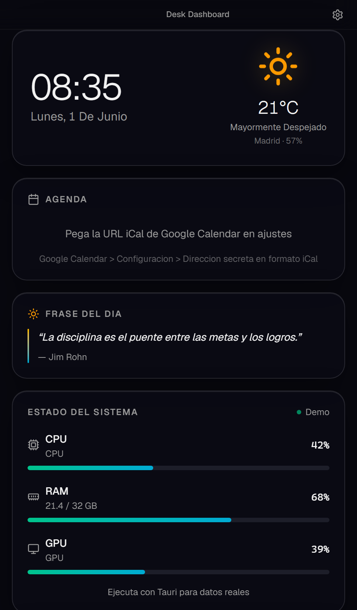
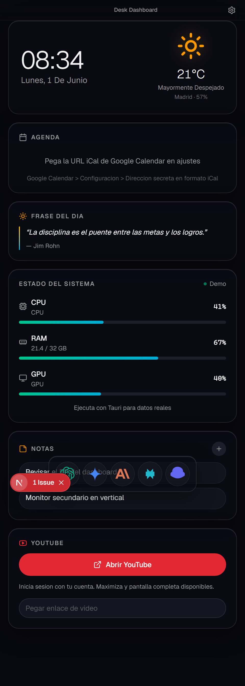
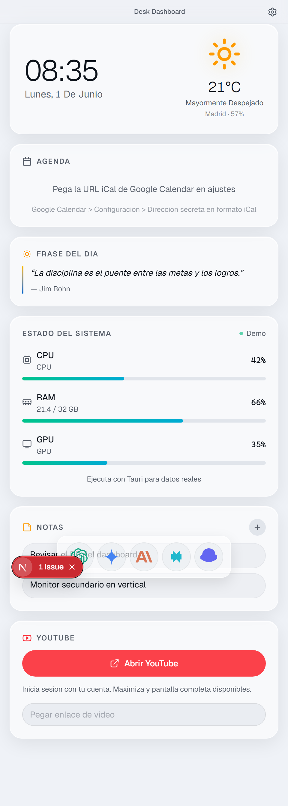
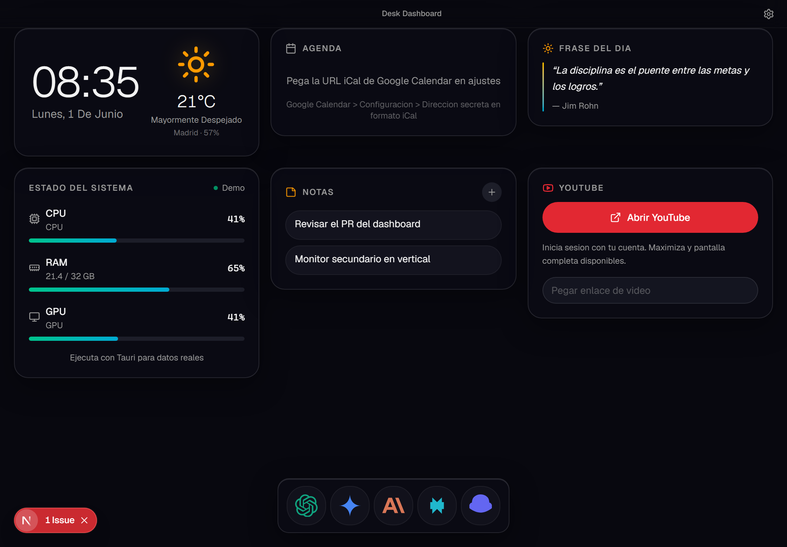

# Desk Dashboard

<p align="center">
  
</p>

<p align="center">
  <strong>App de escritorio premium (Tauri + Next.js)</strong> para Windows — pensada para dejar fija en un monitor secundario con clima, agenda, hardware, notas, YouTube y acceso rapido a IAs.
</p>

<p align="center">
  <a href="https://github.com/moisesvalero/personal-dashboard/releases/latest">Descargar .exe</a>
  ·
  <a href="https://github.com/moisesvalero/personal-dashboard">Repositorio</a>
  ·
  <a href="./CHANGELOG.md">Changelog</a>
</p>

---

## Por que este proyecto (para reclutadores)

Proyecto **personal de producto completo**: no es solo una UI, sino una aplicacion de escritorio publicable con backend nativo en Rust, empaquetado, actualizaciones firmadas y documentacion orientada a usuario final.

Demuestra:

- **Frontend**: React 19, Next.js 16 (export estatico), TypeScript estricto, Tailwind v4, diseno responsive y sistema de temas (claro/oscuro).
- **Desktop**: Tauri v2 — ventana sin marcos, system tray, autostart, atajo global, webviews secundarias (YouTube).
- **Integracion de sistemas**: lectura de hardware (sysinfo, NVML, WMI/LibreHardwareMonitor), fetch de calendario iCal sin CORS, notificaciones nativas.
- **Calidad**: ESLint, Prettier, CI de release, changelog semver, landing con FAQ.

## Capturas

| Vertical (oscuro)                                      | Vertical (claro)                                       |
| ------------------------------------------------------ | ------------------------------------------------------ |
|  |  |

| Horizontal (oscuro)                                           |
| ------------------------------------------------------------- |
|  |

## Stack tecnico

| Capa    | Tecnologia                                                                          |
| ------- | ----------------------------------------------------------------------------------- |
| UI      | Next.js 16, React 19, TypeScript, Tailwind CSS v4, shadcn/ui                        |
| Desktop | Tauri v2, plugins (window-state, autostart, global-shortcut, notification, updater) |
| Backend | Rust — sysinfo, reqwest, WMI, NVML                                                  |
| Datos   | Open-Meteo (clima), Google Calendar iCal, localStorage (ajustes y notas)            |

## Funcionalidades destacadas

- Reloj y clima (Open-Meteo, sin API key, geolocalizacion opcional)
- Calendario Google via URL iCal (sin Google Apps Script)
- Monitor de CPU / RAM / GPU con temperaturas reales (LibreHardwareMonitor + NVIDIA NVML)
- Dock de IAs con iconos oficiales (ChatGPT, Gemini, Claude, Perplexity, Copilot)
- YouTube en ventana integrada con sesion persistente
- Notas locales, frase del dia, widgets reordenables por arrastre
- Auto-actualizacion desde GitHub Releases (Tauri updater)

## Arquitectura (resumen)

```text
Next.js (out/)  ←→  WebView Tauri  ←→  Rust commands
                         │
                         ├── get_system_info
                         ├── fetch_ical
                         ├── open_youtube_window
                         └── WMI / NVML sensores
```

## Desarrollo local

```bash
npm install
npm run dev          # Vista web http://localhost:3000
npm run tauri:dev    # App de escritorio
npm run tauri:build  # Instalador Windows (.exe)
```

### Comprobaciones

```bash
npm run lint
npm run typecheck
npm run build
npm run format:check
```

### Regenerar capturas (marketing / README)

Con el servidor de desarrollo en marcha:

```bash
npm run dev
npm run screenshots
```

Genera PNG en `public/screenshots/` (usados en README y `/landing`).

## Configuracion rapida

| Funcion            | Como                                                                                                                              |
| ------------------ | --------------------------------------------------------------------------------------------------------------------------------- |
| Calendario         | Ajustes → URL iCal secreta de Google Calendar                                                                                     |
| Clima              | Ciudad o deteccion automatica                                                                                                     |
| YouTube            | Widget → Abrir YouTube                                                                                                            |
| Temperaturas       | [LibreHardwareMonitor](https://github.com/LibreHardwareMonitor/LibreHardwareMonitor) como admin o empaquetado en `src-tauri/bin/` |
| Autostart / hotkey | Ajustes en la app                                                                                                                 |

## Publicar release

```bash
git tag v0.2.0
git push origin v0.2.0
```

Configura el secret `TAURI_SIGNING_PRIVATE_KEY` en GitHub (ver [docs/UPDATER.md](docs/UPDATER.md)).

## Licencia

MIT — [LICENSE](LICENSE)
